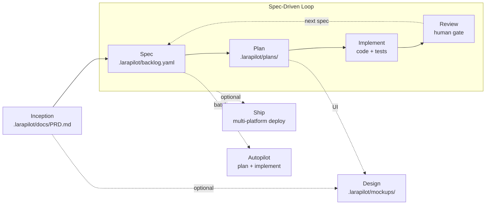

# Larapilot

**From a rough product idea to reviewed Laravel code, with an AI product team that follows a real process.**

Larapilot ports the [ARchetipo](https://github.com/techreloaded-ar/ARchetipo) spec-driven workflow to **Laravel and PHP**, integrated with [Laravel Boost](https://laravel.com/ai/boost). Instead of a Go CLI, Larapilot uses Artisan commands and Boost skills/MCP tools so your AI agent gets both a disciplined product process and deep Laravel context.

---

## Why Larapilot

AI agents are fast, but isolated prompts are not a product process. Larapilot turns your assistant into a disciplined squad:

- **A workflow, not prompt lore** — discovery → backlog → plan → implement → review → ship
- **Spec-driven by default** — `spec → plan → implement` repeats per increment
- **Persistent artifacts** — PRD, backlog, specs, plans, mockups live in your repo
- **Laravel-native** — Boost docs, schema, Tinker, and conventions during implementation
- **Multilingual** — artifacts and conversation in any language; English is the fallback when the language cannot be determined

---

## How it works

Larapilot is not a chat template — it is a **product process backed by files and a CLI**. Three pieces work together:

| Layer | What it is | Role |
| ----- | ---------- | ---- |
| **Skills** | `/larapilot-*` commands in your AI editor (via Boost) | Playbooks: which personas speak, what to read, which Artisan commands to run |
| **Artisan CLI** | `php artisan larapilot:*` | Validates input, persists artifacts, enforces workflow transitions — every response is a JSON envelope |
| **Artifacts** | `.larapilot/` in your repo | Source of truth: PRD, backlog, specs, plans, mockups — version-controlled and shared across sessions |

Your editor connects to two MCP servers: **Laravel Boost** (docs, schema, Tinker, Laravel context) and **Larapilot** (workflow state, backlog operations). Skills orchestrate the conversation; the CLI guarantees consistency; artifacts survive between sessions.

### The discovery interview

Everything starts with `/larapilot-inception`. You bring a rough idea — one sentence is enough. Mark (PM), Jennifer (Strategist), and John (Architect) run a **guided conversation**, not a form to fill in one shot.

**What they explore:**

- Market positioning, competitive context, and product risks (Jennifer)
- Market research and enterprise business perspective (Benjamin)
- Competitive challenger: integrations and **competitor data porting** — import paths for users switching from rival products, lock-in-free export (Sebastian)
- Product scope, personas, and **delivery target** (`MVP`, `V1 Complete`, `Full Product`, `Enterprise`) — Mark asks early via AskQuestion; MVP is the default lens, not a hard ceiling
- SOLID, scalable, performant architecture within budget (John + Aurora) — you can set **Budget Sensitivity** to `Relaxed` to exclude budget evaluation; business validation is loosened to short advisories, never removed
- For public websites: SEO, Analytics, tracking, Lighthouse targets (Emma) and social strategy (Lauren)
- When personal data is involved: GDPR and privacy requirements (Violet)

**How the interview behaves:**

- Agents speak in character (`💎 Mark:`, `🧭 Jennifer:`, `📐 John:`) so you see which lens is asking
- Questions appear only when critical — at most **3 per round**, grouped in one message; you can skip any of them
- Fixed options are shown as interactive **AskQuestion** cards in the editor, not plain A/B/C text in chat
- The agent infers what it can from your codebase and existing artifacts before asking
- The conversation follows your language; the PRD is written in the same language

When there is enough context, the team drafts a **Product Requirements Document** with required sections (Elevator Pitch, Vision, Personas, Functional Requirements, MVP Scope, Technical Architecture), saves it via `larapilot:prd-write`, and validates it with `larapilot:validate-prd`. Inception does **not** create the backlog — that is the next skill (`/larapilot-spec`).

### From PRD to shipped code

After the PRD, each user story follows the same loop:

1. **`/larapilot-spec`** — breaks the MVP into backlog entries (`backlog.yaml` + `specs/US-XXX.yaml`)
2. **`/larapilot-plan US-XXX`** — technical plan with tasks → status **PLANNED**
3. **`/larapilot-implement US-XXX`** — code and tests under the plan → **REVIEW**
4. **`/larapilot-review US-XXX`** — you approve (**DONE**) or send back with feedback (**TODO**)
5. **`/larapilot-ship`** *(optional)* — Lars OWASP gate; Jack deploys (Cipi preferred, or Forge, Laravel Cloud, Ploi, Kubernetes, custom); Emma and Lauren verify web launch for public sites

The CLI blocks invalid jumps (e.g. implement before plan, approve before review). Optional `/larapilot-design` adds UI mockups before planning or implementation. Use `/larapilot-autopilot` to batch-plan and implement multiple specs when the backlog is stable.

---

## Requirements

- PHP **^8.3**
- Laravel **^12** or **^13**
- [Laravel Boost](https://laravel.com/ai/boost) `^1.0` or `^2.0` (installed automatically with Larapilot)
- An AI editor with MCP support (Cursor, Claude Code, etc.)

---

## Quickstart

### 1. Install

Three commands, run from your Laravel project root:

```bash
# 1a. Add the package (Laravel Boost comes as a dependency — no separate require)
composer require andreapollastri/larapilot --dev

# 1b. Initialize the .larapilot/ workspace
php artisan larapilot:install

# 1c. Publish guidelines and the /larapilot-* skills via Laravel Boost
php artisan boost:install
```

`larapilot:install` creates the workspace and tells you what comes next:

```text
INFO  Larapilot installed successfully.

  - .larapilot/config.yaml
  - .larapilot/shared-runtime.md

Next: run php artisan boost:install (or boost:update --discover) to publish AI skills and guidelines.
```

`boost:install` asks which editors and agents you use, then publishes the Larapilot **guidelines** (coding rules — not a skill) and the eight **`/larapilot-*` skills** (`inception`, `design`, `spec`, `plan`, `implement`, `review`, `ship`, `autopilot`) for them. Already running Boost in the project? Use `php artisan boost:update --discover` instead.

On an already-installed project, `larapilot:install` fails fast and points you to `larapilot:update` (after upgrades) or `--force` (to overwrite config). Your customizations in `.larapilot/config.yaml` are never touched by `larapilot:update`.

### 2. Enable MCP servers

Register both servers in your editor — **Boost** for Laravel context (docs, schema, Tinker), **Larapilot** for workflow state:

| Server          | Command | Args                          |
| --------------- | ------- | ----------------------------- |
| `laravel-boost` | `php`   | `artisan boost:mcp`           |
| `larapilot`     | `php`   | `artisan mcp:start larapilot` |

Concrete example for editors with a JSON MCP config (Cursor: `.cursor/mcp.json`, Claude Code: `.mcp.json`):

```json
{
    "mcpServers": {
        "laravel-boost": {
            "command": "php",
            "args": ["artisan", "boost:mcp"]
        },
        "larapilot": {
            "command": "php",
            "args": ["artisan", "mcp:start", "larapilot"]
        }
    }
}
```

### 3. Use skills in your AI agent

Eight workflow skills — each orchestrates a phase via Artisan commands:

| Skill                         | Purpose                                                    |
| ----------------------------- | ---------------------------------------------------------- |
| `/larapilot-inception`        | Product discovery → `.larapilot/docs/PRD.md`               |
| `/larapilot-design`           | UI mockups → `.larapilot/mockups/{spec}/` (dev route `/mockups/{spec}`) |
| `/larapilot-spec`             | Backlog & user stories                                     |
| `/larapilot-plan US-001`      | Technical plan & tasks                                     |
| `/larapilot-implement US-001` | Code, tests, review                                        |
| `/larapilot-review US-001`    | Human acceptance gate                                      |
| `/larapilot-ship`             | OWASP gate + multi-platform deploy + web launch checks    |
| `/larapilot-autopilot`        | Batch plan + implement                                     |

### 4. Example: from idea to done

Start with a fresh Laravel app and this prompt in your AI editor:

> I want a simple team task board: user registration, projects, and assignable tasks.

| Step | You invoke | What happens | Output / status |
| ---- | ---------- | ------------ | --------------- |
| 1. Discovery | `/larapilot-inception` | Guided interview: problem, users, MVP scope, stack — then PRD written and validated | `.larapilot/docs/PRD.md` |
| 2. Backlog | `/larapilot-spec` | User stories extracted from the PRD MVP scope | `backlog.yaml`, `specs/US-001.yaml`, `specs/US-002.yaml` … (**TODO**) |
| 3. Design *(optional)* | `/larapilot-design US-001` | Elise builds a registration screen mockup | `.larapilot/mockups/US-001/` → browse at `/mockups/US-001` |
| 4. Plan | `/larapilot-plan US-001` | John and Alex break down migrations, routes, tests | `plans/US-001-plan.yaml` → **PLANNED** |
| 5. Implement | `/larapilot-implement US-001` | Alex implements, Anne tests; Robert and Lars review via readonly sub-agents (or inline) | Laravel code + Pest tests → **REVIEW** |
| 6. Accept | `/larapilot-review US-001` | You approve or request changes | **DONE** — or back to **TODO** with feedback |
| 7. Ship *(optional)* | `/larapilot-ship` | Lars OWASP gate; Jack deploys (Cipi, Forge, Cloud, Ploi, K8s, custom); Emma & Lauren for public sites | Production release |
| 8. Next spec | `/larapilot-plan US-002` … | Repeat plan → implement → review for each story | until the backlog is complete |

After step 6, your repo might look like this:

```text
.larapilot/
├── docs/
│   ├── PRD.md
│   ├── security/
│   └── launch/
├── backlog.yaml
├── specs/
│   ├── US-001.yaml
│   └── US-002.yaml
├── plans/
│   └── US-001-plan.yaml
└── mockups/
    └── US-001/
        └── index.html
```

Use `/larapilot-autopilot` to batch-plan and implement multiple specs when the backlog is stable. Check progress anytime:

```bash
php artisan larapilot:metrics  # backlog progress
```

### 5. Verify installation

```bash
php artisan larapilot:doctor
```

```json
{
    "schema": "larapilot/v1",
    "kind": "doctor",
    "data": {
        "healthy": true,
        "checks": {
            "config": true,
            "shared_runtime": true,
            "backlog": false,
            "prd": false,
            "boost": true
        },
        "project_root": "/path/to/your-app"
    }
}
```

`data.healthy` is `true` when config, shared runtime, and Boost are in place. On a fresh install `backlog` and `prd` are still `false` — expected: they turn `true` after `/larapilot-inception` (PRD) and `/larapilot-spec` (backlog).

### 6. Keep it updated

Boost publishes guidelines and skills as **copies** into your editor directories, so after upgrading the package one command brings everything current — the shared runtime doc, the Larapilot guidelines, and the `/larapilot-*` skills:

```bash
composer update andreapollastri/larapilot
php artisan larapilot:update
```

`larapilot:update` never touches `.larapilot/config.yaml` — your project customizations survive — and re-runs `boost:update` with the editor and agent choices you already made during `boost:install` (no questions asked). Pass `--skip-boost` to refresh only the shared runtime and manage Boost publishing yourself.

To keep the project aligned automatically, hook it into Composer in your app's `composer.json`:

```json
"scripts": {
    "post-update-cmd": [
        "@php artisan larapilot:update --ansi"
    ]
}
```

From then on every `composer update` republishes runtime, guidelines, and skills — nothing goes stale silently. Run `php artisan larapilot:doctor` anytime to confirm the install is healthy.

---

## Workflow



### Workflow states

| State         | Meaning                      | Next step                    |
| ------------- | ---------------------------- | ---------------------------- |
| `TODO`        | Spec exists, not yet planned | `/larapilot-plan`            |
| `PLANNED`     | Technical plan complete      | `/larapilot-implement`       |
| `IN PROGRESS` | Implementation started       | Complete tasks → review      |
| `REVIEW`      | Ready for human review       | `/larapilot-review`          |
| `DONE`        | Accepted (human-gated)       | Next spec or `/larapilot-ship` |

Transitions are enforced: `spec-plan` refuses specs already in `REVIEW` or `DONE`, `spec-start` requires `PLANNED`, `spec-review` requires `IN PROGRESS`, and `spec-approve`/`spec-request-changes` require `REVIEW`. Commands attempting an invalid transition fail with an `E_PRECONDITION` envelope and exit code `4`.

---

## The AI team

Personas are lenses that make the process visible:

| Persona     | Role                              | Main expertise                                 |
| ----------- | --------------------------------- | ---------------------------------------------- |
| 💎 Mark     | Product Manager                   | Product scope, personas, delivery-target choice, scope trade-offs |
| 🧭 Jennifer | Business Strategist               | Market positioning, competitive context, product risks |
| 🏢 Benjamin | Business Consultant             | Market research, enterprise know-how, business lens on technical choices |
| 💡 Sebastian | Innovator                        | Competitive challenger, vendor integrations, competitor data porting (import from rivals, lock-in-free export) |
| 🔎 Tom      | Requirements Analyst              | Acceptance criteria, edge cases, spec quality  |
| 📐 John     | Architect                         | Scalable architecture, multi-tenancy trade-offs, APIs, queues, DTOs, OpenAPI/docs |
| 🔧 Alex     | Full-Stack Developer              | Implementation and task breakdown              |
| 🧪 Anne     | Test Architect                    | Pest/PHPUnit strategy, CI test gates           |
| 🛡️ Robert   | Code Reviewer                     | Code quality, Gitflow hygiene, Laravel conventions |
| 🔐 Lars     | Security Expert                   | OWASP, security.txt, SECURITY.md, pipeline gates |
| 🚀 Jack     | DevOps Engineer                   | Gitflow, CI/CD, semver, Cloudflare, AWS, observability, deploy |
| 💰 Aurora   | FinOps Expert                     | Infra/security/marketing budgets; security spend never first cut |
| ⚖️ Violet   | Legal Expert                      | GDPR, cookie/ToS, **EAA/accessibility law**, retention, opt-out |
| 📈 Emma     | SEO & Web Performance Specialist  | URLs, breadcrumbs, robots/sitemap/llms, semantic SEO, Lighthouse a11y |
| 💬 Lauren   | Social Media Manager              | Marketing (newsletter, campaigns, SEM), OG/share — with Emma, Elise, Aurora |
| 🎨 Elise    | UX Designer                       | Nordic UI, WCAG 2.2 AA, **logo, favicon.svg, OG/social assets** |
| 💬 Lauren   | Social Media Manager              | Marketing, OG/share — distributes Elise assets when needed |

### Team policies

**Budget Sensitivity** — during inception, Aurora asks whether budget should drive decisions (`Tracked`, the default) or whether you want to exclude budget evaluation (`Relaxed`). In `Relaxed` mode the business figures (Aurora, Benjamin, Jennifer) stop asking budget questions and never block a choice on cost, but they keep flagging vendor lock-in and hard-to-reverse cost risks as short advisories — validation is loosened, never removed. The choice is stored in the PRD under `## Technical Architecture`.

**Competitor data porting** — Sebastian doesn't stop at "import/export" as a feature label: whenever comparable products exist, he must propose concrete migration paths that bring data **from competitor products into yours** (CSV/API importers, onboarding flows for switchers) and structured export so users are never locked in. These become Functional Requirements and first-class backlog specs.

**Vendor & package policy** — new dependencies are evaluated in this order: Laravel built-ins/first-party → [Spatie packages](https://spatie.be/open-source/packages) (the preferred third-party source) → [Filament](https://filamentphp.com/) and its plugins (the preferred route for admin/control panels) → other community vendors. Every candidate must be actively maintained, version-compatible, and pass `composer audit` before it lands in your project.

**Architecture standards** — John scopes depth to delivery target; **multi-tenancy** patterns compared with pros/cons (distributed monolith + subdomains, row-level, DB/schema-per-tenant, stancl/tenancy). APIs, queues, DTOs, OpenAPI/Swagger. Socialite SSO.

**Development & delivery** — **Gitflow** (`main`, `develop`, `feature/*`, `release/*`, `hotfix/*`); **SemVer** + **CHANGELOG.md** (Keep a Changelog); **`security.txt`** + **`SECURITY.md`**; CI/CD minimum gates (Pest, Pint, `composer audit`, checkpoint).

**Security budget** — Aurora privileges security spend; Lars and Violet review against best practice and regulations.

**Cloud & infra** — **Cloudflare** preferred for DNS, CDN, and WAF (alternatives: AWS WAF + CloudFront, Bunny, Akamai, Fastly). Jack proposes **AWS** compute step-by-step when budget allows; **DigitalOcean** as alternative; **Hetzner** and **OVH** for EU. **Observability** always proposed: Laravel Nightwatch, AWS CloudWatch, or alternatives (Datadog, Grafana, …). Local dev: Sail or Herd; [127001.it](https://127001.it/) for wildcard local URLs.

**UX & frontend** — Elise: Laravel UI, Nordic design, WCAG 2.2 AA, **logo + favicon.svg + social assets** (when client provides none). Lauren uses Elise's OG/share artwork.

**Marketing** — Lauren drives newsletter, campaigns, SEM (Aurora budget), with Emma and Elise.

**Privacy & legal** — Violet covers cookie policy, Terms of Service, anonymization, opt-out, log retention, subprocessors, and data-subject rights — from inception through ship.

---

## Artisan CLI

Skills call these commands; you rarely run them manually:

| Command                          | Purpose                          |
| -------------------------------- | -------------------------------- |
| `larapilot:install`              | Initialize project               |
| `larapilot:update`               | Refresh runtime + skills after upgrade |
| `larapilot:doctor`               | Diagnose installation            |
| `larapilot:config-show`          | Project metadata (JSON envelope) |
| `larapilot:prd-write`            | Save PRD                         |
| `larapilot:validate-prd`         | Validate PRD structure           |
| `larapilot:spec-list`            | List backlog                     |
| `larapilot:spec-add`             | Add specs                        |
| `larapilot:spec-show`            | Show spec + tasks                |
| `larapilot:spec-next`            | Auto-select next spec            |
| `larapilot:validate-spec`        | Validate spec payload            |
| `larapilot:validate-plan`        | Validate plan payload            |
| `larapilot:spec-plan`            | Save plan → PLANNED              |
| `larapilot:spec-start`           | → IN PROGRESS                    |
| `larapilot:task-done`            | Mark task complete               |
| `larapilot:spec-review`          | → REVIEW                         |
| `larapilot:spec-request-changes` | → TODO with feedback             |
| `larapilot:spec-approve`         | → DONE                           |
| `larapilot:spec-delete`          | Remove spec + plan files         |
| `larapilot:metrics`              | Backlog progress                 |

All commands emit JSON envelopes with schema `larapilot/v1`.

### JSON envelope

Success on stdout:

```json
{"schema":"larapilot/v1","kind":"<kind>","data":{...}}
```

Errors on stderr:

```json
{"schema":"larapilot/v1","kind":"error","error":{"code":"E_*","message":"...","hint":"..."}}
```

Branch on `error.code`, never on message text. Common error codes: `E_INVALID_INPUT`, `E_PRECONDITION`, `E_NOT_FOUND`, `E_CONNECTOR`.

### Exit codes

Agents can rely on exit codes without parsing the envelope:

| Code | Meaning                                                             |
| ---- | ------------------------------------------------------------------- |
| `0`  | Success (validations: payload is valid)                             |
| `1`  | Generic error                                                       |
| `2`  | Invalid input / validation failed                                   |
| `3`  | Connector error                                                     |
| `4`  | Precondition failed or not found (missing spec, invalid transition) |

---

## Configuration

`.larapilot/config.yaml`:

```yaml
connector: file

paths:
    prd: .larapilot/docs/PRD.md
    mockups: .larapilot/mockups/
    test_results: .larapilot/docs/test-results/
    security: .larapilot/docs/security/
    launch: .larapilot/docs/launch/

workflow:
    statuses:
        todo: TODO
        planned: PLANNED
        in_progress: IN PROGRESS
        review: REVIEW
        done: DONE

file:
    backlog: .larapilot/backlog.yaml
    specs: .larapilot/specs/
    planning: .larapilot/plans/
```

### Mockup preview route

Mockups live in `.larapilot/mockups/{spec}/` (outside `public/`) and are served via a dynamic route **only outside production**. The `{spec}` segment must match the mockup folder name — typically a backlog code like `US-001`, but any valid folder name works.

| Environment                   | URL pattern              | Access                 |
| ----------------------------- | ------------------------ | ---------------------- |
| `local`, `staging`, `testing` | `/mockups/{spec}`        | ✅ Browsable           |
| `production`                  | —                        | ❌ Route disabled, 404 |

Examples (folder → URL):

- `.larapilot/mockups/US-001/index.html` → `/mockups/US-001` (serves `index.html` by default)
- `.larapilot/mockups/US-001/css/app.css` → `/mockups/US-001/css/app.css`

Disable entirely with `LARAPILOT_MOCKUPS_ROUTE=false` in `.env`.

### Environment variables

| Variable                  | Default  | Description                                      |
| ------------------------- | -------- | ------------------------------------------------ |
| `LARAPILOT_ENABLED`       | `true`   | Disable MCP and mockup route when `false`        |
| `LARAPILOT_CONNECTOR`     | `file`   | Storage connector                                |
| `LARAPILOT_MOCKUPS_ROUTE` | `true`   | Set `false` to disable the mockup preview route  |

When `LARAPILOT_ENABLED=false`, MCP and the mockup route are gated off. Artisan commands and `larapilot:doctor` remain available.

### Worktree support

`spec-show` and `spec-next` return `data.workdir` — the absolute directory for per-spec codebase work (e.g. a git worktree). Connector commands still run from `data.project_root` returned by `config-show`.

---

## Larapilot MCP

Register alongside Laravel Boost. Three tools designed to work with Boost:

| Tool           | Description                              |
| -------------- | ---------------------------------------- |
| `backlog_list` | List all specs with status               |
| `spec_show`    | Spec details, plan tasks, workdir        |
| `run_artisan`  | Run any `larapilot:*` command            |

---

## Larapilot + Boost

| Concern               | Larapilot | Laravel Boost |
| --------------------- | --------- | ------------- |
| Product workflow      | ✅        | —             |
| PRD, backlog, plans   | ✅        | —             |
| Laravel docs search   | —         | ✅            |
| Database schema/query | —         | ✅            |
| Tinker, logs, routes  | —         | ✅            |
| Coding guidelines     | partial   | ✅            |

During **plan** and **implement**, skills instruct the agent to use Boost MCP tools for Laravel-specific work.

### Sub-agents

On editors with a sub-agent tool (Cursor Task tool, Claude Code Agent tool, …), two skills spawn **readonly sub-agents** for fresher context — with an inline fallback when the editor has none:

| Skill | Sub-agents | Purpose |
| ----- | ---------- | ------- |
| `/larapilot-plan` | codebase explore *(optional)* | Map a large codebase before writing tasks |
| `/larapilot-implement` | code review + security review *(parallel)* | Robert code review + Lars OWASP pass after all tasks are done |

The **parent agent** always owns `php artisan larapilot:*` calls and code fixes. Implement writes `.larapilot/docs/review/US-XXX.md` for `/larapilot-review` to present to you — with or without sub-agents. Autopilot never forks sub-agents — one spec at a time. Details in `.larapilot/shared-runtime.md` → **Sub-agents**.

### Language & validation

Artifacts can be in **any language**. The structure is fixed; only headings and content are translated.

| Artifact | Required structure | Heading format |
| -------- | -------------------- | -------------- |
| PRD | 6 sections (pitch, vision, personas, requirements, MVP scope, architecture) | `## …` |
| Spec body | User Story, Demonstrates, Acceptance Criteria | `## …` or `**…**` |
| Plan task | Description | `## …` |

The CLI recognizes common translations (English, Italian, Spanish, French, …). If a heading is not recognized literally, validation still passes when the document has enough **marked headings**:

- **PRD** — 6× `## …` (one per section)
- **Spec body** — 3× `## …` or `**…**` (User Story, Demonstrates, Acceptance Criteria)
- **Plan task** — 1× `## …` per task (Description)

Plain prose does not count — each section needs its own heading.

---

## Credits

Inspired by [ARchetipo](https://github.com/techreloaded-ar/ARchetipo) by techreloaded. Larapilot is an independent Laravel vertical port.

## License

MIT © Andrea Pollastri
