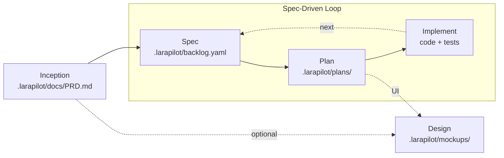

# Larapilot

**From a rough product idea to reviewed Laravel code, with an AI product team that follows a real process.**

Larapilot ports the [ARchetipo](https://github.com/techreloaded-ar/ARchetipo) spec-driven workflow to **Laravel and PHP**, integrated with [Laravel Boost](https://laravel.com/ai/boost). Instead of a Go CLI, Larapilot uses Artisan commands and Boost skills/MCP tools so your AI agent gets both a disciplined product process and deep Laravel context.

---

## Why Larapilot

AI agents are fast, but isolated prompts are not a product process. Larapilot turns your assistant into a disciplined squad:

- **A workflow, not prompt lore** — discovery → backlog → plan → implement → review
- **Spec-driven by default** — `spec → plan → implement` repeats per increment
- **Persistent artifacts** — PRD, backlog, specs, plans, mockups live in your repo
- **Laravel-native** — Boost docs, schema, Tinker, and conventions during implementation
- **Multilingual** — artifacts and conversation in any language; English is the fallback when the language cannot be determined

---

## How it works

Larapilot is not a chat template — it is a **product process backed by files and a CLI**. Three pieces work together:

| Layer | What it is | Role |
| ----- | ---------- | ---- |
| **Skills** | `/larapilot-*` commands in your AI editor (via Boost) | Playbooks: which personas speak, what to read, which Artisan commands to run |
| **Artisan CLI** | `php artisan larapilot:*` | Validates input, persists artifacts, enforces workflow transitions — every response is a JSON envelope |
| **Artifacts** | `.larapilot/` in your repo | Source of truth: PRD, backlog, specs, plans, mockups — version-controlled and shared across sessions |

Your editor connects to two MCP servers: **Laravel Boost** (docs, schema, Tinker, Laravel context) and **Larapilot** (workflow state, backlog operations). Skills orchestrate the conversation; the CLI guarantees consistency; artifacts survive between sessions.

### The discovery interview

Everything starts with `/larapilot-inception`. You bring a rough idea — one sentence is enough. Mark (PM), Jennifer (Strategist), and John (Architect) run a **guided conversation**, not a form to fill in one shot.

**What they explore:**

- The problem and who feels it
- Target users and their goals
- Product positioning and MVP boundaries (in scope / out of scope)
- High-level Laravel stack assumptions (packages, auth, UI stack)

**How the interview behaves:**

- Agents speak in character (`💎 Mark:`, `🧭 Jennifer:`, `📐 John:`) so you see which lens is asking
- Questions appear only when critical — at most **3 per round**, grouped in one message; you can skip any of them
- Fixed options are shown as interactive **AskQuestion** cards in the editor, not plain A/B/C text in chat
- The agent infers what it can from your codebase and existing artifacts before asking
- The conversation follows your language; the PRD is written in the same language

When there is enough context, the team drafts a **Product Requirements Document** with required sections (Elevator Pitch, Vision, Personas, Functional Requirements, MVP Scope, Technical Architecture), saves it via `larapilot:prd-write`, and validates it with `larapilot:validate-prd`. Inception does **not** create the backlog — that is the next skill (`/larapilot-spec`).

### From PRD to shipped code

After the PRD, each user story follows the same loop:

1. **`/larapilot-spec`** — breaks the MVP into backlog entries (`backlog.yaml` + `specs/US-XXX.yaml`)
2. **`/larapilot-plan US-XXX`** — technical plan with tasks → status **PLANNED**
3. **`/larapilot-implement US-XXX`** — code and tests under the plan → **REVIEW**
4. **`/larapilot-review US-XXX`** — you approve (**DONE**) or send back with feedback (**TODO**)

The CLI blocks invalid jumps (e.g. implement before plan, approve before review). Optional `/larapilot-design` adds UI mockups before planning or implementation.

---

## Quickstart

### 1. Install

```bash
composer require andreapollastri/larapilot --dev
php artisan larapilot:install
php artisan boost:install
```

Laravel Boost is installed automatically as a Larapilot dependency — no separate `composer require` needed.

`larapilot:install` creates `.larapilot/config.yaml` and `.larapilot/shared-runtime.md`.

`boost:install` publishes Larapilot **guidelines** and **skills** from the package.

### 2. Enable MCP servers

Register both Boost and Larapilot in your editor:

| Server          | Command | Args                          |
| --------------- | ------- | ----------------------------- |
| `laravel-boost` | `php`   | `artisan boost:mcp`           |
| `larapilot`     | `php`   | `artisan mcp:start larapilot` |

### 3. Use skills in your AI agent

| Skill                         | Purpose                                                    |
| ----------------------------- | ---------------------------------------------------------- |
| `/larapilot-inception`        | Product discovery → `.larapilot/docs/PRD.md`               |
| `/larapilot-design`           | UI mockups → `.larapilot/mockups/{spec}/` (dev route `/mockups/{spec}`) |
| `/larapilot-spec`             | Backlog & user stories                                     |
| `/larapilot-plan US-001`      | Technical plan & tasks                                     |
| `/larapilot-implement US-001` | Code, tests, review                                        |
| `/larapilot-review US-001`    | Human acceptance gate                                      |
| `/larapilot-autopilot`        | Batch plan + implement                                     |

### 4. Example: from idea to done

Start with a fresh Laravel app and this prompt in your AI editor:

> I want a simple team task board: user registration, projects, and assignable tasks.

| Step | You invoke | What happens | Output / status |
| ---- | ---------- | ------------ | --------------- |
| 1. Discovery | `/larapilot-inception` | Guided interview: problem, users, MVP scope, stack — then PRD written and validated | `.larapilot/docs/PRD.md` |
| 2. Backlog | `/larapilot-spec` | User stories extracted from the PRD MVP scope | `backlog.yaml`, `specs/US-001.yaml`, `specs/US-002.yaml` … (**TODO**) |
| 3. Design *(optional)* | `/larapilot-design US-001` | Elise builds a registration screen mockup | `.larapilot/mockups/US-001/` → browse at `/mockups/US-001` |
| 4. Plan | `/larapilot-plan US-001` | John and Alex break down migrations, routes, tests | `plans/US-001-plan.yaml` → **PLANNED** |
| 5. Implement | `/larapilot-implement US-001` | Alex implements, Anne writes tests, Robert reviews | Laravel code + Pest tests → **REVIEW** |
| 6. Accept | `/larapilot-review US-001` | You approve or request changes | **DONE** — or back to **TODO** with feedback |
| 7. Next spec | `/larapilot-plan US-002` … | Repeat plan → implement → review for each story | until the backlog is complete |

After step 6, your repo might look like this:

```text
.larapilot/
├── docs/
│   └── PRD.md
├── backlog.yaml
├── specs/
│   ├── US-001.yaml
│   └── US-002.yaml
├── plans/
│   └── US-001-plan.yaml
└── mockups/
    └── US-001/
        └── index.html
```

Use `/larapilot-autopilot` to batch-plan and implement multiple specs when the backlog is stable. Check progress anytime:

```bash
php artisan larapilot:metrics  # backlog progress
```

---

## Workflow



### Workflow states

| State         | Meaning                      |
| ------------- | ---------------------------- |
| `TODO`        | Spec exists, not yet planned |
| `PLANNED`     | Technical plan complete      |
| `IN PROGRESS` | Implementation started       |
| `REVIEW`      | Ready for human review       |
| `DONE`        | Accepted (human-gated)       |

Transitions are enforced: `spec-start` requires `PLANNED`, `spec-review` requires `IN PROGRESS`, and `spec-approve`/`spec-request-changes` require `REVIEW`. Commands attempting an invalid transition fail with an `E_PRECONDITION` envelope and exit code `4`.

---

## The AI team

Personas are lenses that make the process visible:

| Persona     | Role                 | Main expertise                                 |
| ----------- | -------------------- | ---------------------------------------------- |
| 💎 Mark     | Product Manager      | Vision, personas, MVP scope                    |
| 🧭 Jennifer | Business Strategist  | Discovery, positioning, product hypotheses     |
| 🔎 Mark     | Requirements Analyst | Acceptance criteria, edge cases, spec quality  |
| 📐 John     | Architect            | Technical solution and architectural decisions |
| 🔧 Alex     | Full-Stack Developer | Implementation and task breakdown              |
| 🧪 Anne     | Test Architect       | Test strategy and coverage                     |
| 🛡️ Robert   | Code Reviewer        | Quality, security, adherence to the plan       |
| 🎨 Elise    | UX Designer          | Mockups and visual language                    |

---

## Artisan CLI

Skills call these commands; you rarely run them manually:

| Command                          | Purpose                          |
| -------------------------------- | -------------------------------- |
| `larapilot:install`              | Initialize project               |
| `larapilot:doctor`               | Diagnose installation            |
| `larapilot:config-show`          | Project metadata (JSON envelope) |
| `larapilot:prd-write`            | Save PRD                         |
| `larapilot:validate-prd`         | Validate PRD structure           |
| `larapilot:spec-list`            | List backlog                     |
| `larapilot:spec-add`             | Add specs                        |
| `larapilot:spec-show`            | Show spec + tasks                |
| `larapilot:spec-next`            | Auto-select next spec            |
| `larapilot:validate-spec`        | Validate spec payload            |
| `larapilot:validate-plan`        | Validate plan payload            |
| `larapilot:spec-plan`            | Save plan → PLANNED              |
| `larapilot:spec-start`           | → IN PROGRESS                    |
| `larapilot:task-done`            | Mark task complete               |
| `larapilot:spec-review`          | → REVIEW                         |
| `larapilot:spec-request-changes` | → TODO with feedback             |
| `larapilot:spec-approve`         | → DONE                           |
| `larapilot:spec-delete`          | Remove spec + plan files         |
| `larapilot:metrics`              | Backlog progress                 |

All commands emit JSON envelopes with schema `larapilot/v1`.

### Exit codes

Agents can rely on exit codes without parsing the envelope:

| Code | Meaning                                                             |
| ---- | ------------------------------------------------------------------- |
| `0`  | Success (validations: payload is valid)                             |
| `1`  | Generic error                                                       |
| `2`  | Invalid input / validation failed                                   |
| `3`  | Connector error                                                     |
| `4`  | Precondition failed or not found (missing spec, invalid transition) |

---

## Configuration

`.larapilot/config.yaml`:

```yaml
connector: file

paths:
    prd: .larapilot/docs/PRD.md
    mockups: .larapilot/mockups/
    test_results: .larapilot/docs/test-results/

workflow:
    statuses:
        todo: TODO
        planned: PLANNED
        in_progress: IN PROGRESS
        review: REVIEW
        done: DONE

file:
    backlog: .larapilot/backlog.yaml
    specs: .larapilot/specs/
    planning: .larapilot/plans/
```

### Mockup preview route

Mockups live in `.larapilot/mockups/{spec}/` (outside `public/`) and are served via a dynamic route **only outside production**. The `{spec}` segment must match the mockup folder name — typically a backlog code like `US-001`, but any valid folder name works.

| Environment                   | URL pattern              | Access                 |
| ----------------------------- | ------------------------ | ---------------------- |
| `local`, `staging`, `testing` | `/mockups/{spec}`        | ✅ Browsable           |
| `production`                  | —                        | ❌ Route disabled, 404 |

Examples (folder → URL):

- `.larapilot/mockups/US-001/index.html` → `/mockups/US-001` (serves `index.html` by default)
- `.larapilot/mockups/US-001/css/app.css` → `/mockups/US-001/css/app.css`

Disable entirely with `LARAPILOT_MOCKUPS_ROUTE=false` in `.env`.

---

## Larapilot + Boost

| Concern               | Larapilot | Laravel Boost |
| --------------------- | --------- | ------------- |
| Product workflow      | ✅        | —             |
| PRD, backlog, plans   | ✅        | —             |
| Laravel docs search   | —         | ✅            |
| Database schema/query | —         | ✅            |
| Tinker, logs, routes  | —         | ✅            |
| Coding guidelines     | partial   | ✅            |

During **plan** and **implement**, skills instruct the agent to use Boost MCP tools for Laravel-specific work.

### Language & validation

Artifacts can be in **any language**. The structure is fixed; only headings and content are translated.

| Artifact | Required structure | Heading format |
| -------- | -------------------- | -------------- |
| PRD | 6 sections (pitch, vision, personas, requirements, MVP scope, architecture) | `## …` |
| Spec body | User Story, Demonstrates, Acceptance Criteria | `## …` or `**…**` |
| Plan task | Description | `## …` |

The CLI recognizes common translations (English, Italian, Spanish, French, …). If a heading is not recognized literally, validation still passes when the document has enough **marked headings**:

- **PRD** — 6× `## …` (one per section)
- **Spec body** — 3× `## …` or `**…**` (User Story, Demonstrates, Acceptance Criteria)
- **Plan task** — 1× `## …` per task (Description)

Plain prose does not count — each section needs its own heading.

---

## Credits

Inspired by [ARchetipo](https://github.com/techreloaded-ar/ARchetipo) by techreloaded. Larapilot is an independent Laravel vertical port.

## License

MIT © Andrea Pollastri
