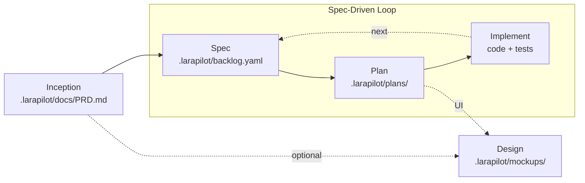

# Larapilot

**From a rough product idea to reviewed Laravel code, with an AI product team that follows a real process.**

Larapilot ports the [ARchetipo](https://github.com/techreloaded-ar/ARchetipo) spec-driven workflow to **Laravel and PHP**, integrated with [Laravel Boost](https://laravel.com/ai/boost). Instead of a Go CLI, Larapilot uses Artisan commands and Boost skills/MCP tools so your AI agent gets both a disciplined product process and deep Laravel context.

---

## Why Larapilot

AI agents are fast, but isolated prompts are not a product process. Larapilot turns your assistant into a disciplined squad:

- **A workflow, not prompt lore** — discovery → backlog → plan → implement → review
- **Spec-driven by default** — `spec → plan → implement` repeats per increment
- **Persistent artifacts** — PRD, backlog, specs, plans, mockups live in your repo
- **Laravel-native** — Boost docs, schema, Tinker, and conventions during implementation
- **Bilingual** — English default; Italian supported when the conversation or artifacts are in Italian

---

## Quickstart

### 1. Install

```bash
composer require andreapollastri/larapilot --dev
composer require laravel/boost --dev
php artisan larapilot:install
php artisan boost:install
```

`larapilot:install` creates `.larapilot/config.yaml` and `.larapilot/shared-runtime.md`.

`boost:install` publishes Larapilot **guidelines** and **skills** from the package.

### 2. Enable MCP servers

Register both Boost and Larapilot in your editor:

| Server | Command | Args |
| --- | --- | --- |
| `laravel-boost` | `php` | `artisan boost:mcp` |
| `larapilot` | `php` | `artisan mcp:start larapilot` |

### 3. Use skills in your AI agent

| Skill | Purpose |
| --- | --- |
| `/larapilot-inception` | Product discovery → `.larapilot/docs/PRD.md` |
| `/larapilot-design` | UI mockups → `.larapilot/mockups/` (dev route `/mockups/`) |
| `/larapilot-spec` | Backlog & user stories |
| `/larapilot-plan US-001` | Technical plan & tasks |
| `/larapilot-implement US-001` | Code, tests, review |
| `/larapilot-review US-001` | Human acceptance gate |
| `/larapilot-autopilot` | Batch plan + implement |

---

## Workflow



### Workflow states

| State | Meaning |
| --- | --- |
| `TODO` | Spec exists, not yet planned |
| `PLANNED` | Technical plan complete |
| `IN PROGRESS` | Implementation started |
| `REVIEW` | Ready for human review |
| `DONE` | Accepted (human-gated) |

---

## The AI team

Personas are lenses that make the process visible:

| Persona | Role | Main expertise |
| --- | --- | --- |
| 💎 Mark | Product Manager | Vision, personas, MVP scope |
| 🧭 Jennifer | Business Strategist | Discovery, positioning, product hypotheses |
| 🔎 Mark | Requirements Analyst | Acceptance criteria, edge cases, spec quality |
| 📐 John | Architect | Technical solution and architectural decisions |
| 🔧 Alex | Full-Stack Developer | Implementation and task breakdown |
| 🧪 Anne | Test Architect | Test strategy and coverage |
| 🛡️ Robert | Code Reviewer | Quality, security, adherence to the plan |
| 🎨 Elise | UX Designer | Mockups and visual language |

---

## Artisan CLI

Skills call these commands; you rarely run them manually:

| Command | Purpose |
| --- | --- |
| `larapilot:install` | Initialize project |
| `larapilot:doctor` | Diagnose installation |
| `larapilot:config-show` | Project metadata (JSON envelope) |
| `larapilot:prd-write` | Save PRD |
| `larapilot:validate-prd` | Validate PRD structure |
| `larapilot:spec-list` | List backlog |
| `larapilot:spec-add` | Add specs |
| `larapilot:spec-show` | Show spec + tasks |
| `larapilot:spec-next` | Auto-select next spec |
| `larapilot:validate-spec` | Validate spec payload |
| `larapilot:validate-plan` | Validate plan payload |
| `larapilot:spec-plan` | Save plan → PLANNED |
| `larapilot:spec-start` | → IN PROGRESS |
| `larapilot:task-done` | Mark task complete |
| `larapilot:spec-review` | → REVIEW |
| `larapilot:spec-request-changes` | → TODO with feedback |
| `larapilot:spec-approve` | → DONE |
| `larapilot:metrics` | Backlog progress |

All commands emit JSON envelopes with schema `larapilot/v1`.

---

## Configuration

`.larapilot/config.yaml`:

```yaml
connector: file

paths:
  prd: .larapilot/docs/PRD.md
  mockups: .larapilot/mockups/
  test_results: .larapilot/docs/test-results/

workflow:
  statuses:
    todo: TODO
    planned: PLANNED
    in_progress: IN PROGRESS
    review: REVIEW
    done: DONE

file:
  backlog: .larapilot/backlog.yaml
  specs: .larapilot/specs/
  planning: .larapilot/plans/
```

### Mockup preview route

Mockups are stored outside `public/` and served via a dynamic route **only outside production**:

| Environment | URL | Access |
| --- | --- | --- |
| `local`, `staging`, `testing` | `/mockups/US-001/` | ✅ Browsable |
| `production` | — | ❌ Route disabled, 404 |

Disable entirely with `LARAPILOT_MOCKUPS_ROUTE=false` in `.env`.

---

## Larapilot + Boost

| Concern | Larapilot | Laravel Boost |
| --- | --- | --- |
| Product workflow | ✅ | — |
| PRD, backlog, plans | ✅ | — |
| Laravel docs search | — | ✅ |
| Database schema/query | — | ✅ |
| Tinker, logs, routes | — | ✅ |
| Coding guidelines | partial | ✅ |

During **plan** and **implement**, skills instruct the agent to use Boost MCP tools for Laravel-specific work.

---

## Credits

Inspired by [ARchetipo](https://github.com/techreloaded-ar/ARchetipo) by techreloaded. Larapilot is an independent Laravel vertical port.

## License

MIT © Andrea Pollastri
